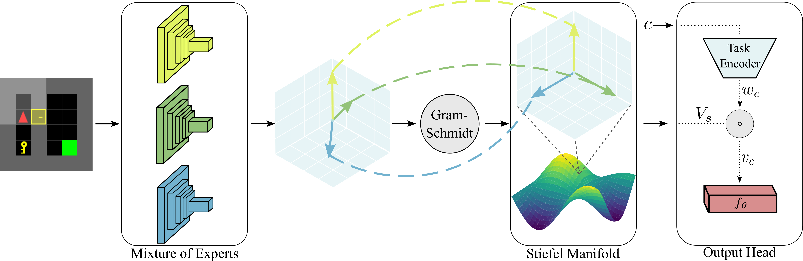

# MOORE

Official code of the paper [Multi-Task Reinforcement Learning with Mixture of Orthogonal Experts](https://arxiv.org/abs/2311.11385), which was presented at Twelfth International Conference on Learning Representations (ICLR 2024) in Vienna Austria.



---

## Abstract

Multi-Task Reinforcement Learning (MTRL) tackles the long-standing problem of endowing agents with skills that generalize across a variety of problems. To this end, sharing representations plays a fundamental role in capturing both unique and common characteristics of the tasks. Tasks may exhibit similarities in terms of skills, objects, or physical properties while leveraging their representations eases the achievement of a universal policy. Nevertheless, the pursuit of learning a shared set of diverse representations is still an open challenge. In this paper, we introduce a novel approach for representation learning in MTRL that encapsulates common structures among the tasks using orthogonal representations to promote diversity. Our method, named **Mixture Of Orthogonal Experts (MOORE)**, leverages a Gram-Schmidt process to shape a shared subspace of representations generated by a mixture of experts. When task-specific information is provided, MOORE generates relevant representations from this shared subspace. We assess the effectiveness of our approach on two MTRL benchmarks, namely MiniGrid and MetaWorld, showing that MOORE surpasses related baselines and establishes a new state-of-the-art result on MetaWorld.

---

## Installation

You need to clone this repos and setup the conda environment as follows:

```shell
conda env create -f environment.yml
```

---

## Experiments

This version of the codebase allows the reproducibity of the **main** (Fig. 2 in the paper) and **transfer** (Fig. 3 in the paper) results on **MiniGrid** [1].

In `run/minigrid`, we have three different folders corresponding to three different learning settings: `single_task`, `multi_task`, and `transfer`. 

### Single-Task
Here is an example on how to run the `single_task` experiment:

```shell
conda activate moore_minigrid

cd run/minigrid/single_task

sh run_minigrid_ppo_st.sh [ENV_NAME]
```

You need to replace `[ENV_NAME]` with one of the environment names listed below:
- MiniGrid-DoorKey-6x6-v0
- MiniGrid-DistShift1-v0
- MiniGrid-RedBlueDoors-6x6-v0
- MiniGrid-LavaGapS7-v0
- MiniGrid-MemoryS11-v0
- MiniGrid-SimpleCrossingS9N2-v0
- MiniGrid-MultiRoom-N2-S4-v0

By default, we use `wandb` to log the results of the experiments. In general, for any `bash` script, you need to replace `[WANDB_ENTITY]` with your wandb entity. Otherwise, you can comment the `wandb` activation: `# --wandb --wandb_entity [WANDB_ENTITY]`.

### Multi-Task
Here is an example on how to run our MOORE algorithm experiment : 

```shell
conda activate moore_minigrid

cd run/minigrid/multi_task

sh run_minigrid_ppo_mt_moore_multihead.sh [ENV_NAME] [N_FEATURES] [N_EXPERTS]
```

For `[ENV_NAME]`, we replace it with one of the following multi-task settings: `MT3`, `MT5`, or `MT7` while the value of `[N_EXPERTS]` is one of the following `2`, `3`, or `4`, respectivily. 

**NOTE**: for `MTPPO` baseline, there is no `[N_EXPERTS]` argument to be passed to the corresponding scripts.

### Transfer
Here is an example on how to run our Transfer-MOORE algorithm experiment : 

```shell
conda activate moore_minigrid

cd run/minigrid/transfer

sh run_minigrid_ppo_tl_moore_multihead.sh [ENV_NAME] [N_EXPERTS] [LOAD_DIR]
```

For `[ENV_NAME]`, we replace it with one of the following transfer learning settings: `TL3_5`, or `TL5_7` while the value of `[N_EXPERTS]` is one of the following `2`, or `3`, respectivily.

For `[LOAD_DIR]`, you replace it with the experiment directory of the any algorithm trained on `MT3` or `MT5` for the transfer setting, `TL3_5` or `TL_5_7`, respectivily. 

For example, 

```shell
sh run_minigrid_ppo_tl_moore_multihead.sh TL3_5 2 logs/minigrid/MT/MT3/ppo_mt_moore_multihead_2e
```

**NOTE**: for `*_noinit.sh` experiments, no `[LOAD_DIR]` is needed.

---

## Citation

```
@inproceedings{hendawy2024multi,
  title={Multi-task reinforcement learning with mixture of orthogonal experts},
  author={Hendawy, Ahmed and Peters, Jan and D'Eramo, Carlo},
  booktitle={Twelfth International Conference on Learning Representations (ICLR)},
  year={2024},
  url={https://arxiv.org/abs/2311.11385}}
```

---

## Reference
[1] Chevalier-Boisvert, Maxime, et al. "Minigrid & miniworld: Modular & customizable reinforcement learning environments for goal-oriented tasks." Advances in Neural Information Processing Systems 36 (2024).

---

## TODO
- [ ] MetaWorld setting